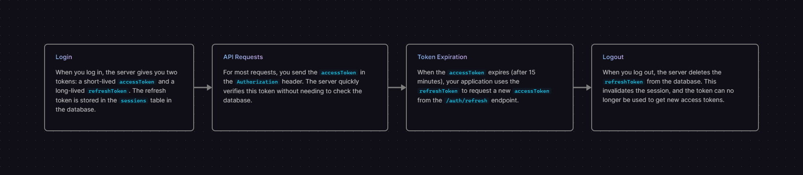

# Hono-Auth API Backend

This project is a secure and robust backend API built with [Hono](https://hono.dev/) on Node.js, using [Drizzle ORM](https://orm.drizzle.team/) for database interactions with a PostgreSQL database. It includes a complete JWT-based authentication system with refresh tokens and a session table for enhanced security.

## Features

- **Fast & Lightweight:** Built with Hono, one of the fastest web frameworks for JavaScript.
- **Type-Safe Database:** Drizzle ORM provides a fully type-safe SQL-like query builder.
- **Secure Authentication:** Implements a modern hybrid authentication strategy.
  - Short-lived JWT Access Tokens (15 minutes).
  - Long-lived, database-backed Refresh Tokens for persistent sessions.
- **Database Migrations:** Drizzle Kit handles all database schema migrations.
- **Ready for Production:** Includes scripts for running in development, production, and debugging.

## Prerequisites

- [Node.js](https://nodejs.org/) (v18 or higher)
- [PostgreSQL](https://www.postgresql.org/) database

## Getting Started

### 1. Clone & Install Dependencies

Clone the repository and install the required npm packages.

```bash
npm install
```

### 2. Set Up Environment Variables

Create a `.env` file in the root of the project by copying the example.

```bash
cp .env.example .env
```

Now, open the `.env` file and configure your variables:

- `DATABASE_URL`: Your full PostgreSQL connection string.
- `FRONTEND_URL`: The URL of your frontend application (e.g., `http://localhost:5173` for development).
- `ACCESS_TOKEN_SECRET`: A long, random, secret string for signing access tokens.

You can do this via console with node:

```bash
node -e "console.log(require('node:crypto').randomBytes(32).toString('hex'));"
```

### 3. Initial Setup and Migrations

Before starting the application, you need to provision at least one tenant schema and run the initial migrations.

1.  **Create a schema** in your PostgreSQL database (e.g., `CREATE SCHEMA my_tenant;`).
2.  **Run the multi-tenant migration script** to set up the tables:

    ```bash
    node migrate-tenants.js
    ```

## Running the Application

- **Development Mode:** Starts the server with hot-reloading.

  ```bash
  npm run dev
  ```

- **Production Mode:** Starts the server in a standard Node.js process.

  ```bash
  npm start
  ```

- **Debugging Mode (VS Code):**
  1.  Make sure the `dev` server is **not** running.
  2.  Set breakpoints directly in your code.
  3.  Go to the "Run and Debug" panel in VS Code.
  4.  Select "Debug Hono App" from the dropdown and click the play button.

## API Endpoints

All endpoints are prefixed with `/api`.

### Authentication (`/auth`)

- `POST /auth/register`

  - Creates a new user.
  - **Body:** `{ "username": "string", "email": "string", "password": "string" }`

- `POST /auth/login`

  - Logs in a user and returns tokens.
  - **Body:** `{ "email": "string", "password": "string" }`
  - **Returns:** `{ user, accessToken, refreshToken }`

- `POST /auth/refresh`

  - Generates a new access token using a valid refresh token.
  - **Body:** `{ "refreshToken": "string" }`
  - **Returns:** `{ accessToken }`

- `POST /auth/logout`
  - Invalidates a session by deleting the refresh token from the database.
  - **Body:** `{ "refreshToken": "string" }`

### Users (`/users`)

- `GET /users/me`
  - **Protected:** Requires a valid `accessToken`.
  - Fetches the profile of the currently authenticated user.
  - **Headers:** `Authorization: Bearer <accessToken>`
  - **Returns:** `{ user }`

## Authentication Flow Explained



This application uses a hybrid token-based authentication system for a balance of performance and security.

1.  **Login:** When you log in with a valid `X-Tenant-Id` header, the server gives you two tokens: a short-lived `accessToken` and a long-lived `refreshToken`. The refresh token is stored in the `sessions` table inside the correct tenant's schema.
2.  **API Requests:** For most requests, you send the `accessToken` in the `Authorization` header and, critically, the `X-Tenant-Id` header. The middleware uses the tenant ID to select a database connection that is correctly scoped to that tenant's schema.
3.  **Token Expiration:** When the `accessToken` expires (after 15 minutes), your application uses the `refreshToken` to request a new `accessToken`. This request must also include the correct `X-Tenant-Id` header to access the right session table.
4.  **Logout:** When you log out, the server uses the `X-Tenant-Id` to find the correct schema and deletes the `refreshToken` from the `sessions` table within it. This effectively invalidates the session for that tenant.

## Multi-Tenancy Support

This API supports a multi-tenant architecture using a **single database with a separate schema per tenant**. This approach provides a great balance of strong data isolation at the database level with simpler operational management.

### How It Works

The system is designed to be clean and scalable. The multi-tenancy logic is handled transparently by a dedicated middleware, keeping the main application logic simple.

1.  **Tenant Identification:** Every incoming API request **must** include an `X-Tenant-Id` header (e.g., `X-Tenant-Id: acme_corp`). This ID is used to identify the tenant and should be a valid PostgreSQL schema name.
2.  **Scoped Connection Pools:** When a request is received, the middleware fetches a dedicated, cached database connection pool for the specified tenant.
3.  **Schema Scoping with `search_path`:** The connection pool for each tenant is configured with PostgreSQL's `search_path` parameter. This means any query executed using that connection pool will automatically run within that tenant's schema. This is secure and efficient, and it means the route handlers don't need to specify the schema on every query.
4.  **Efficiency:** Connections for each tenant are cached in memory. Subsequent requests for the same tenant will reuse existing connections from its pool, avoiding the overhead of establishing a new database connection every time.

This design ensures tenant data is strongly isolated at the schema level while keeping the application code clean, as the business logic doesn't need to be aware of the multi-tenancy implementation details.

## Managing Tenants and Migrations

Since each tenant has their own schema, you need a process for provisioning new tenants and applying database schema changes to all of them.

### Step 1: Provision a New Tenant

To create a new tenant, you must first create a new schema for them in your PostgreSQL database. You can do this with any SQL client.

```sql
CREATE SCHEMA acme_corp;
CREATE SCHEMA another_tenant;
```

### Step 2: Make a Schema Change

Edit any of the schema files in `src/schema/`. For example, let's add a `full_name` column to the `users` table in `src/schema/users.js`.

```javascript
// src/schema/users.js

import { pgTable, serial, text, varchar } from "drizzle-orm/pg-core";

export const users = pgTable("users", {
  id: serial("id").primaryKey(),
  full_name: text("full_name"),
  username: varchar("username", { length: 256 }).notNull().unique(),
  email: varchar("email", { length: 256 }).notNull().unique(),
  passwordHash: text("password_hash").notNull(),
});
```

### Step 3: Generate the Migration File

First, generate the SQL migration file using Drizzle Kit. This command compares your schema files to the database state and creates a new `.sql` file in the `drizzle` directory.

```bash
npm run db:generate
```

### Step 4: Run the Multi-Tenant Migration Script

Instead of the standard `npm run db:push`, you will now use the dedicated multi-tenant migration script. This script automatically discovers all your tenant schemas and applies any pending SQL migrations to each one.

Run the script from your terminal:

```bash
node migrate-tenants.js
```

**Expected Output:**

The script will log its progress, running the migration for each tenant schema it finds.

```
Starting tenant migration process...
Connecting to database to fetch tenant schemas...
Database connection for schema discovery closed.
Found schemas to migrate: acme_corp, another_tenant

▶️  Applying migrations for schema: acme_corp...
[... Drizzle output for applying migrations...]
✅ Migrations for acme_corp completed successfully.

▶️  Applying migrations for schema: another_tenant...
[... Drizzle output for applying migrations...]
✅ Migrations for another_tenant completed successfully.

🎉 All schema migrations have been Applied successfully.
```

This ensures that your schema remains consistent across all tenants automatically.

## Deployment with systemd

For running this application in a production environment on a Linux server, it's recommended to use `systemd` to manage the process.

1.  **Create a service file** on your server at `/etc/systemd/system/hono-auth.service`:

    ```bash
    sudo nano /etc/systemd/system/hono-auth.service
    ```

2.  **Add the following content**, replacing `/path/to/your/project/hono-auth` and `your_user` with your actual project path and Linux username.

    ```ini
    [Unit]
    Description=Hono Auth Backend API
    After=network.target postgresql.service

    [Service]
    # User and Group to run the service as
    User=your_user
    Group=your_user

    # The working directory for the application
    WorkingDirectory=/path/to/your/project/hono-auth

    # The command to start the application
    # It's best to use the full path to npm, which you can find with `which npm`
    ExecStart=/usr/bin/npm start

    # Environment variables needed by the application
    # This securely loads the .env file from your project directory
    EnvironmentFile=/path/to/your/project/hono-auth/.env

    # Restart the service if it fails
    Restart=always
    RestartSec=10

    # Configure logging to be handled by systemd's journal
    StandardOutput=journal
    StandardError=journal

    [Install]
    WantedBy=multi-user.target
    ```

3.  **Reload the systemd daemon, enable, and start the service:**

    ```bash
    sudo systemctl daemon-reload
    sudo systemctl enable --now hono-auth.service
    ```

    The `--now` flag enables and starts the service in a single command.

4.  **Check the status and logs:**
    ```bash
    sudo systemctl status hono-auth.service
    journalctl -u hono-auth.service -f
    ```
